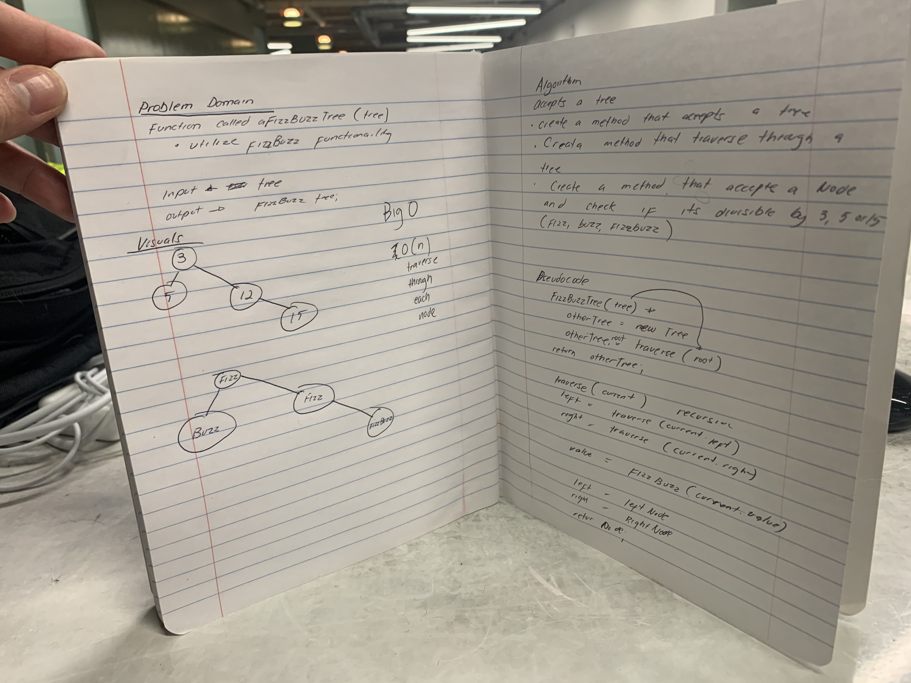

# Data Structures

## Linked List

### Lab 05: Linked List Implementation 

#### Singly Linked List
Implement A Singly Linked List

[Code](https://github.com/martinpapacodes/data-structures-and-algorithms/blob/master/Data-Structures/src/main/java/linkedList/LinkedList.java)

#### Challenge

    Create a Node class that has properties for the value stored in the Node, and a pointer to the next Node.
    Within your LinkedList class, include a head property. Upon instantiation, an empty Linked List should be created.
        Define a method called insert which takes any value as an argument and adds a new node with that value to the head of the list with an O(1) Time performance.
        Define a method called includes which takes any value as an argument and returns a boolean result depending on whether that value exists as a Node’s value somewhere within the list.
        Define a method called toString (or __str__ in Python) which takes in no arguments and returns a string representing all the values in the Linked List, formatted as:
            "{ a } -> { b } -> { c } -> NULL"
    Any exceptions or errors that come from your code should be semantic, capturable errors. For example, rather than a default error thrown by your language, your code should raise/throw a custom, semantic error that describes what went wrong in calling the methods you wrote for this lab.
    Be sure to follow your language/frameworks standard naming conventions (e.g. C# uses PascalCasing for all method and class names).
#### Approach & Efficiency
* When inserting into the head of the LinkedList, it has an O(1).
* When it is calling the toString and includes method, it has O(N).

#### API
* insert(value)
* toString()
* isEmpty()
* includes(value)
* indexOf()

---

### Code Challenge: Class 06 

#### Linked List Insertion
Linked list insertion

[Code](https://github.com/martinpapacodes/data-structures-and-algorithms/blob/master/Data-Structures/src/main/java/linkedList/LinkedList.java)

#### Challenge

    Write the following methods for the Linked List class:
    .append(value) which adds a new node with the given value to the end of the list
    .insertBefore(value, newVal) which add a new node with the given newValue immediately before the first value node
    .insertAfter(value, newVal) which add a new node with the given newValue immediately after the first value node

#### Approach & Efficiency
* The append() method has an O(N) because it adds to the end of the linked list.
* The insertBefore(value, newVal) has an O(1) if values are given is to be inserted in the front, otherwise O(N).
* The insertAfter(value, newVal) has an O(N) because it has to traverse through the list

#### Solution

---

### Code Challenge: Class 07 

#### Linked List (kthFromEnd(k))
k-th value from the end of a linked list

[Code](https://github.com/martinpapacodes/data-structures-and-algorithms/blob/master/Data-Structures/src/main/java/linkedList/LinkedList.java)
                                         
#### Challenge

    Write a method for the Linked List class which takes a number, k, as a parameter. Return the node’s value that is k from the end of the linked list. You have access to the Node class and all the properties on the Linked List class as well as the methods created in previous challenges.`

#### Approach & Efficiency
This method is going to have an O(n) depends on the length of the Linked List.

#### Solution

---

### Code Challenge: Class 08

#### Linked List(merge)
Merge two linked list

[Code](https://github.com/martinpapacodes/data-structures-and-algorithms/blob/master/Data-Structures/src/main/java/linkedList/LinkedList.java)
                                         
#### Challenge

    Write a function called mergeLists which takes two linked lists as arguments. Zip the two linked lists together into one so that the nodes alternate between the two lists and return a reference to the head of the zipped list. Try and keep additional space down to O(1). You have access to the Node class and all the properties on the Linked List class as well as the methods created in previous challenges.
    
#### Approach & Efficiency
The merge itself has an o(n) because it has to traverse through both list, while the space is O(1) because it is returning one list.

#### Solution

---

## Stack and Queue

### Lab 10: Stack and Queue Implementation 

#### Stacks and Queues
Implement Stack and Queues using Linked List

#### Challenge

    Create a Node class that has properties for the value stored in the Node, and a pointer to the next node.
    Create a Stack class that has a top property. It creates an empty Stack when instantiated.
        This object should be aware of a default empty value assigned to top when the stack is created.
        Define a method called push which takes any value as an argument and adds a new node with that value to the top of the stack with an O(1) Time performance.
        Define a method called pop that does not take any argument, removes the node from the top of the stack, and returns the node’s value.
        Define a method called peek that does not take an argument and returns the value of the node located on top of the stack, without removing it from the stack.
        Define a method called isEmpty that does not take an argument, and returns a boolean indicating whether or not the stack is empty.
    Create a Queue class that has a front property. It creates an empty Queue when instantiated.
        This object should be aware of a default empty value assigned to front when the queue is created.
        Define a method called enqueue which takes any value as an argument and adds a new node with that value to the back of the queue with an O(1) Time performance.
        Define a method called dequeue that does not take any argument, removes the node from the front of the queue, and returns the node’s value.
        Define a method called peek that does not take an argument and returns the value of the node located in the front of the queue, without removing it from the queue.
        Define a method called isEmpty that does not take an argument, and returns a boolean indicating whether or not the queue is empty.
    Any exceptions or errors that come from your code should be semantic, capturable errors. For example, rather than a default error thrown by your language, your code should raise/throw a custom, semantic error that describes what went wrong in calling the methods you wrote for this lab.
    Be sure to follow your languages best practices for naming conventions.

#### Approach & Efficiency
* When pushing to stack and enqueuing to the queue has an O(1).
* When popping from a stack, it also has an O(1);
* When dequeuing from queue, it has an O(N) because it has to traverse.
#### API
##### Stack
* push(value)
* isEmpty()
* peek()
* pop()
* display()

##### Queue
* enqueue(value)
* dequeue()
* isEmpty()
* peek()
* display()

### Code Challenge: Class 11 

#### Challenge Summary - PseudoQueue

Implement a Queue using two Stacks.

####  Approach & Efficiency

### Code Challenge: Class 12 

---

## Binary Tree

### Code Challenge: Class 15: Binary Tree and BST Implementation 

#### Singly Binary Tree and BST
Implement Binary Tree and BST

Tree:
[Code](https://github.com/martinpapacodes/data-structures-and-algorithms/blob/master/Data-Structures/src/main/java/tree/Tree.java)

Binary Search Tree:
[Code](https://github.com/martinpapacodes/data-structures-and-algorithms/blob/master/Data-Structures/src/main/java/tree/BinarySearchTree.java)
#### Challenge

    Create a Node class that has properties for the value stored in the node, the left child node, and the right child node.
    Create a BinaryTree class
        Define a method for each of the depth first traversals called preOrder, inOrder, and postOrder which returns an array of the values, ordered appropriately.

    Any exceptions or errors that come from your code should be semantic, capturable errors. For example, rather than a default error thrown by your language, your code should raise/throw a custom, semantic error that describes what went wrong in calling the methods you wrote for this lab.
    Create a BinarySearchTree class
        Define a method named add that accepts a value, and adds a new node with that value in the correct location in the binary search tree.
        Define a method named contains that accepts a value, and returns a boolean indicating whether or not the value is in the tree at least once.

#### Approach & Efficiency
* Recursions was used in the the Tree methods(inOrder, preOrder, postOrder).
    * Time complexities for these methods are O(n) because we have to traverse through the tree.

#### API
* preOrder(root)
* inOrder(root)
* postOrder(root)
* add(value)
* contains(value)

---

###  Code Challenge: Class 16 
#### Fizz Buzz Tree
Implement a fizzBuzz functionality using a tree

fizzBuzzTree:
[Code](https://github.com/martinpapacodes/data-structures-and-algorithms/blob/master/Data-Structures/src/main/java/utilities/FizzBuzzTree.java)

#### Challenge

    
    Write a function called FizzBuzzTree which takes a tree as an argument.
    Without utilizing any of the built-in methods available to your language, determine whether or not the value of each node is divisible by 3, 5 or both. Create a new tree with the same structure as the original, but the values modified as follows:
        If the value is divisible by 3, replace the value with “Fizz”
        If the value is divisible by 5, replace the value with “Buzz”
        If the value is divisible by 3 and 5, replace the value with “FizzBuzz”
        If the value is not divisible by 3 or 5, simply turn the number into a String.
    Return the new tree.

#### Approach & Efficiency
* This method uses an O(n) because it has to traverse through every single node in the tree.

#### API

---

###  Code Challenge: Class 17
#### Breadth First Traversal
Breadth-first Traversal

[Code](https://github.com/martinpapacodes/data-structures-and-algorithms/blob/master/Data-Structures/src/main/java/tree/Tree.java)

#### Challenge

    
    Write a breadth first traversal method which takes a Binary Tree as its unique input. Without utilizing any of the built-in methods available to your language, traverse the input tree using a Breadth-first approach, and return a list of the values in the tree in the order they were encountered.

#### Approach & Efficiency
* This method uses an O(n) because it has to traverse through every single node in the tree.

#### API

