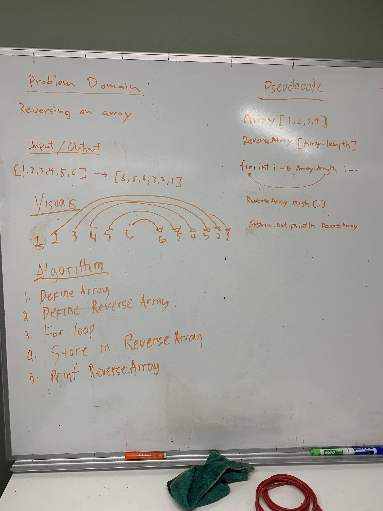
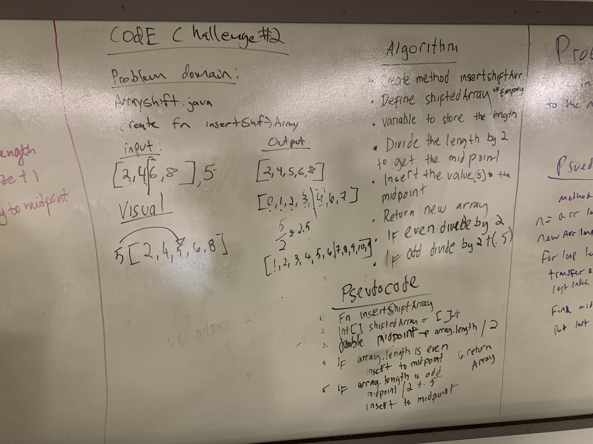

# Table of Contents

# Code Challenge 1: ArrayReverse
Reverse an array

## Challenge
Reversing an array

## Approach & Efficiency
We used a for loop and started from the arrays length and use i--. We also started our iterator with the array's length;

## Solution

---

# Code Challenge 2: ArrayShift
Shift an array by inserting a value to the midpoint.

## Challenge
Write a function called insertShiftArray which takes in an array and the value to be added. Without utilizing any of the built-in methods available to your language, return an array with the new value added at the middle index.

## Approach & Efficiency
If the size of an array is even, divide the size by 2. If odd, then divide by 2 then add .5. Insert the value to the index.

## Solution

